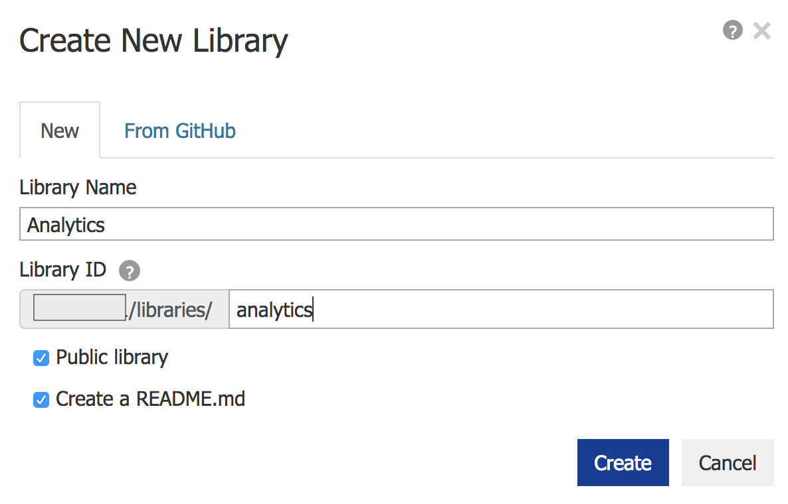
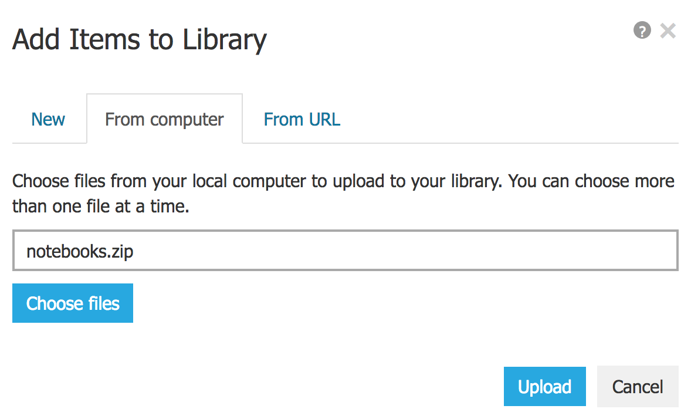
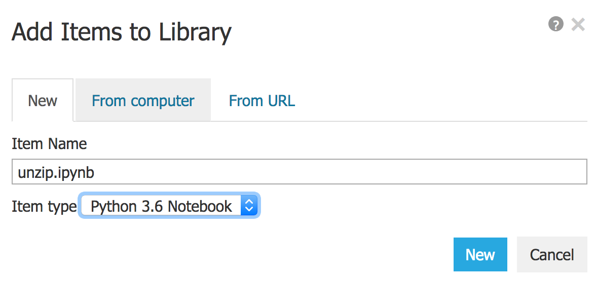
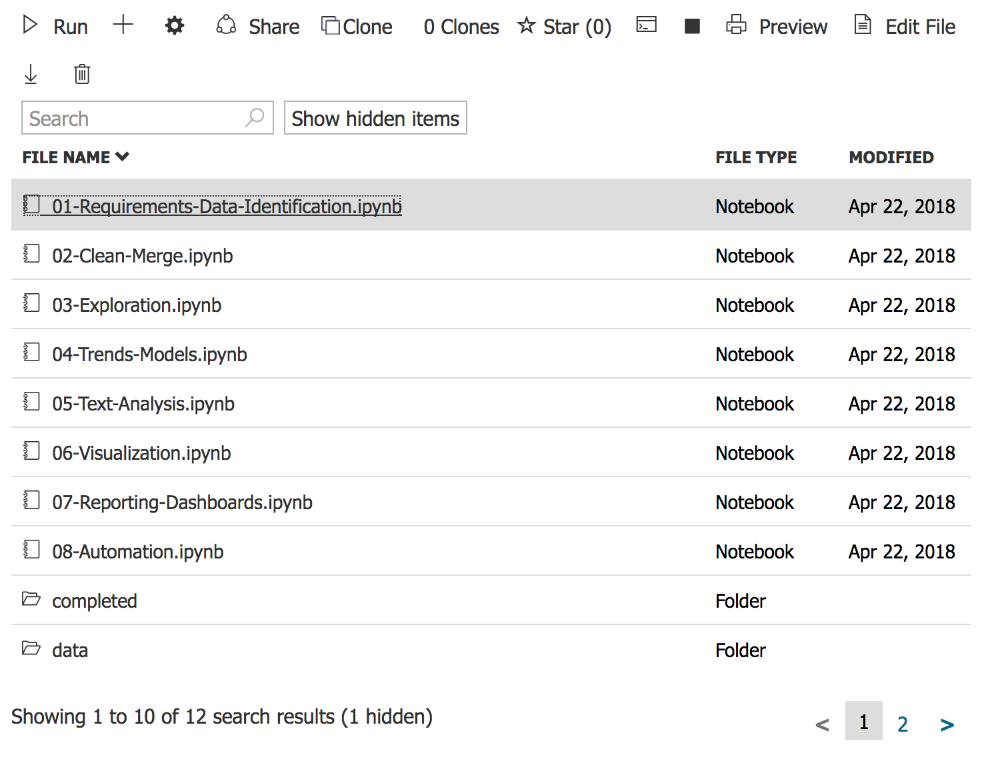

# Getting Started - Azure Notebooks

The following guide can be used to get started using
[Azure Notebooks](https://notebooks.azure.com)

## Using Azure Notebooks

Note that while most of the content of the notebooks can be run in Azure
Notebooks, the Python dashboard code in [Unit 7](07-Reporting-Dashboards.ipynb)
will not run correctly.

To begin, download notebook zip file.

Sign into [Azure Notebooks](https://notebooks.azure.com) with a Microsoft
account - a CSCC email address will work. Once logged in, select *Libraries*
from the menus.

<figure>
  
  <figcaption style="text-align: center; font-weight: bold">Select Libraries from the Menu</figcaption>
</figure>

On the *Libraries* screen, click the *+New Library* button. Enter a library
name an a library ID.  Click the *Create* button.

<figure>
  
  <figcaption style="text-align: center; font-weight: bold">New Library Details</figcaption>
</figure>

To upload the notebook zip file, click the *+* button. In the pop-up window,
select the *From Computer* tab. Click the *Choose Files* button, select the
previously downloaded notebook zip file, and click the *Upload* button.
Depending on the speed of your Internet connection, the upload could take some
time.

<figure>
  
  <figcaption style="text-align: center; font-weight: bold">Add Items</figcaption>
</figure>

With the zip file uploaded, we now have to extract its contents.  To do this,
we'll use a new notebook.  Click the *+* button again, enter an item name like
"unzip" and select "Python 3.6" as the type.  Click *New*.

<figure>
  
  <figcaption style="text-align: center; font-weight: bold">Create New Notebook</figcaption>
</figure>

Click the newly created notebook file to open it. In the first cell, enter the
following and execute it by pressing SHIFT and ENTER. 

``` ipython
!unzip *.zip
```

This will take a few minutes. Execution is complete when `In [*]` is replaced
with `In [1]`.  Once complete, close the notebook by closing the browser tab.
Return to the library page and refresh it. You should now see a new folder
created from the zip file; click the folder name to open it. 

To open a notebook, double-click on the notebook file.

<figure>
  
  <figcaption style="text-align: center; font-weight: bold">List of Notebook Files</figcaption>
</figure>

After opening a notebook, make sure it is running with Python 3.6 or later by
checking the upper, right corner of the notebook page.

<figure>
  
  <figcaption style="text-align: center; font-weight: bold">Python Version</figcaption>
</figure>

To change the Python version, select *Kernel*, *Change kernel*, and
*Python 3.6* (or a new version).

ear the beginning of most notebooks, one cell contains code necessary to
install third-party libraries using `pip`. These cells should complete
successfully in Azure Notebooks.
