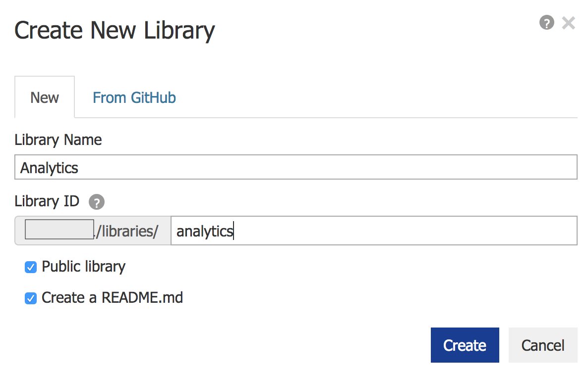
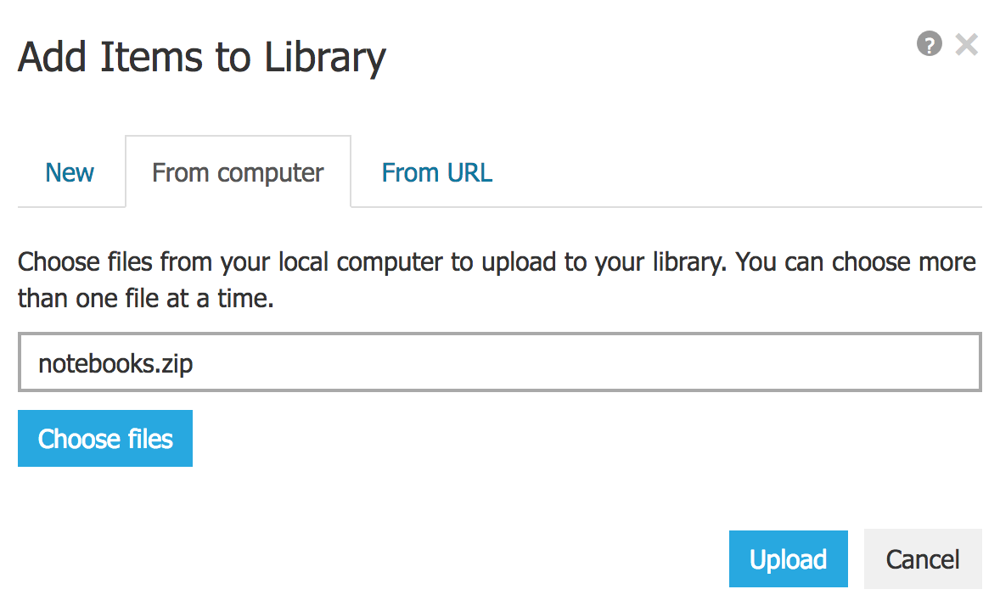
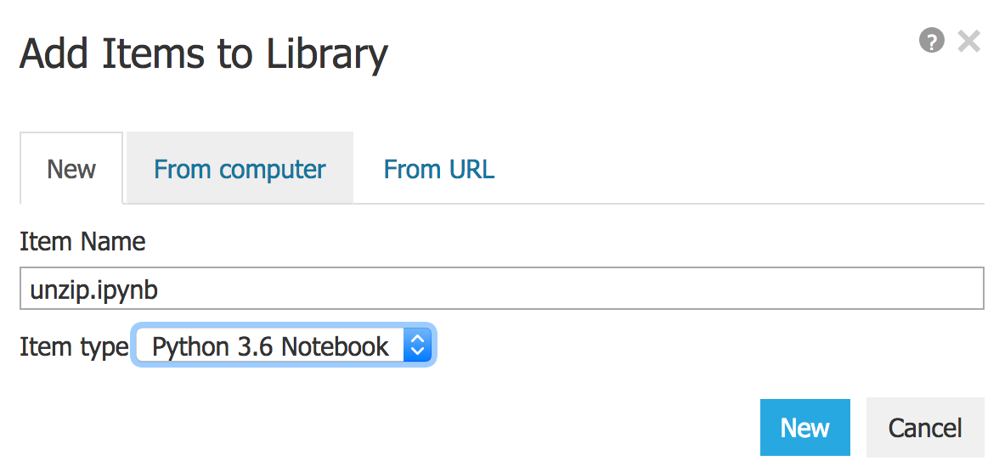
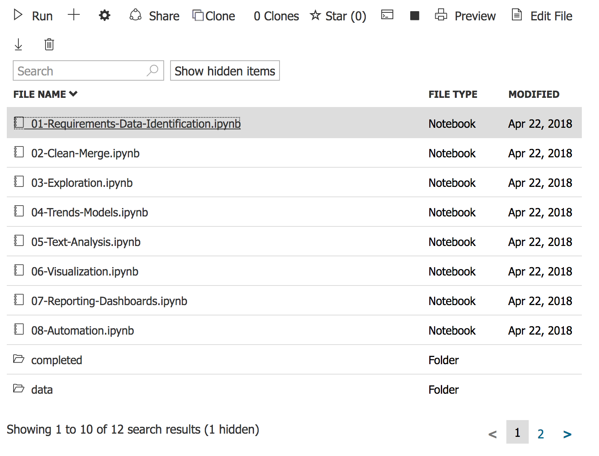

# Getting Started

The preferred method of executing the notebooks is locally with
[Anaconda](https://www.anaconda.com/download) or in the cloud using
[Azure Notebooks](https://notebooks.azure.com).

## Using Anaconda

Download notebook zip file and extract its contents.

Download [Anaconda](https://www.anaconda.com/download) and follow the
[installation instructions](https://docs.anaconda.com/anaconda/install/) to
install the software.

After installation is complete, the run the *Jupyter Notebook* program from
the Start Menu, browse to the location to which the notebooks were extracted,
and open the desired notebook.

Near the beginning of most notebooks, one cell contains code necessary to
install third-party libraries using `pip`.  Because some of these libraries
require non-Python code to be compiled, this step can fail in Windows. An 
alternative method of installing the libraries using the Anaconda Prompt and
`conda` is provided.

To install all the required libraries for all the notebooks at once, open the 
Anaconda prompt and execute the following command.

``` shell
conda install -c conda-forge --yes pandas lxml requests xlrd geopandas seaborn statsmodels beautifulsoup4 textblob tinydb folium python-docx  plotly boto3
```

After executing the `conda install` command, execute the following in Anaconda
prompt.

``` shell
pip install requests_oauthlib squarify dash dash-renderer dash-html-components dash-core-components
```

These installation commands have been verified on Windows 10 64-bit and may not
work with other versions of Windows.

## Using Azure Notebooks

Note that while most of the content of the notebooks can be run in Azure
Notebooks, the Python dashboard code in [Unit 7](07-Reporting-Dashboards.ipynb)
will not run correctly.

To begin, download notebook zip file.

Sign into [Azure Notebooks](https://notebooks.azure.com) with a Microsoft
account - a CSCC email address will work. Once logged in, select *Libraries*
from the menus.

<figure>
  
  <figcaption style="text-align: center; font-weight: bold">Select Libraries from the Menu</figcaption>
</figure>

On the *Libraries* screen, click the *+New Library* button. Enter a library
name an a library ID.  Click the *Create* button.

<figure>
  
  <figcaption style="text-align: center; font-weight: bold">New Library Details</figcaption>
</figure>

To upload the notebook zip file, click the *+* button. In the pop-up window,
select the *From Computer* tab. Click the *Choose Files* button, select the
previously downloaded notebook zip file, and click the *Upload* button.
Depending on the speed of your Internet connection, the upload could take some
time.

<figure>
  
  <figcaption style="text-align: center; font-weight: bold">Add Items</figcaption>
</figure>

With the zip file uploaded, we now have to extract its contents.  To do this,
we'll use a new notebook.  Click the *+* button again, enter an item name like
"unzip" and select "Python 3.6" as the type.  Click *New*.

<figure>
  
  <figcaption style="text-align: center; font-weight: bold">Create New Notebook</figcaption>
</figure>

Click the newly created notebook file to open it. In the first cell, enter the
following and execute it by pressing SHIFT and ENTER. 

``` ipython
!unzip *.zip
```

This will take a few minutes. Execution is complete when `In [*]` is replaced
with `In [1]`.  Once complete, close the notebook by closing the browser tab.
Return to the library page and refresh it. You should now see a new folder
created from the zip file; click the folder name to open it. 

To open a notebook, double-click on the notebook file.

<figure>
  
  <figcaption style="text-align: center; font-weight: bold">List of Notebook Files</figcaption>
</figure>

After opening a notebook, make sure it is running with Python 3.6 or later by
checking the upper, right corner of the notebook page.

<figure>
  
  <figcaption style="text-align: center; font-weight: bold">Python Version</figcaption>
</figure>

To change the Python version, select *Kernel*, *Change kernel*, and
*Python 3.6* (or a new version).

ear the beginning of most notebooks, one cell contains code necessary to
install third-party libraries using `pip`. These cells should complete
successfully in Azure Notebooks.
